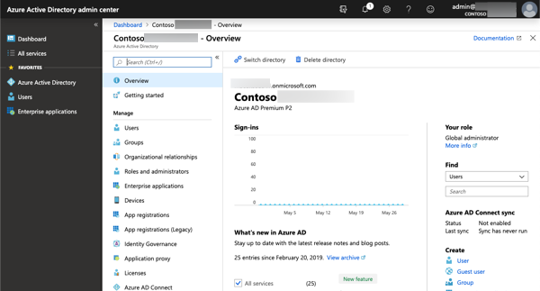
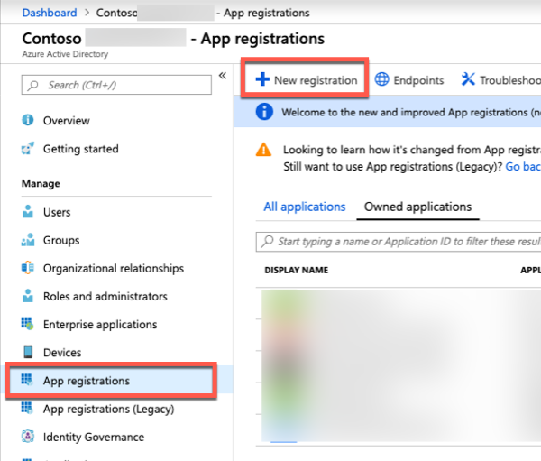
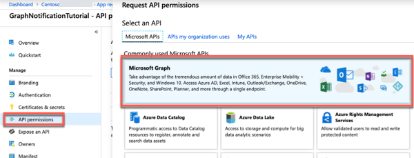

<!-- markdownlint-disable MD002 MD041 -->

En este ejercicio, creará un nuevo registro de aplicaciones Web de Azure AD con el centro de administración de Azure Active Directory y otorgará el consentimiento del administrador a los ámbitos de permiso necesarios.

1. Abra un explorador y vaya al [centro de administración de Azure Active Directoryhttps://aad.portal.azure.com)(](https://aad.portal.azure.com). Inicie sesión con una **cuenta profesional o educativa**.

1. Seleccione **Azure Active Directory** en el panel de navegación de la izquierda y, después, seleccione **registros de aplicaciones** en **administrar**.

    

1. Seleccione **Nuevo registro**. En la página **registrar una aplicación**

    

    Establezca los valores de la siguiente manera:

    - **Nombre**: GraphNotificationTutorial
    - **Tipos de cuenta compatibles**: cuentas de cualquier directorio de la organización y cuentas personales de Microsoft
    - **URI**de redireccionamiento: > Webhttp://localhost

    

    Seleccione **registrar**.

1. En la página **GraphNotificationTutorial** , copie el valor del identificador de la **aplicación (cliente)** y el **identificador del directorio (tenant)** guárdelos, los necesitará en el paso siguiente.

    

1. Seleccione **administrar certificados de > & secretos**. 

    Seleccione **nuevo secreto de cliente**.

    Escriba un valor en **Descripción** y seleccione una de las opciones para **Expires** y seleccione **Agregar**.

    

    

1. Copie el valor del secreto de cliente antes de salir de esta página. Lo necesitará en el siguiente paso.

    > [!IMPORTANT]
    > El secreto de cliente no se vuelve a mostrar, así que asegúrese de copiarlo en este momento.

    

1. Seleccione **administrar permisos**de la API de >.

    Seleccione **Agregar un permiso** y seleccione **Microsoft Graph**.

    

    Seleccione **permiso de aplicación**, expanda el grupo de **usuarios** y seleccione **User. ReadWrite. All** Scope.

    Seleccione **Agregar permisos** para guardar los cambios.

    

    

La aplicación solicita un permiso de aplicación con el ámbito **User. ReadWrite. All** . Este permiso requiere consentimiento administrativo.

Seleccione **conceder consentimiento de administrador para contoso**y, a continuación, seleccione **sí** para aceptar la aplicación y conceder a la aplicación acceso a su inquilino mediante los ámbitos especificados.

