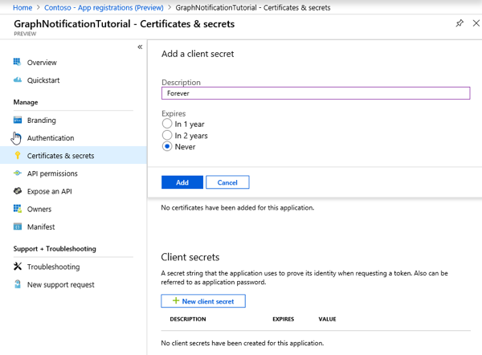
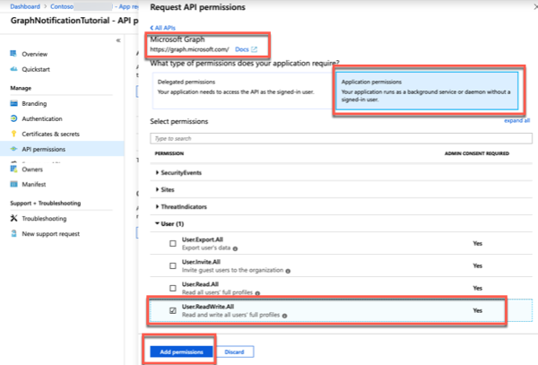
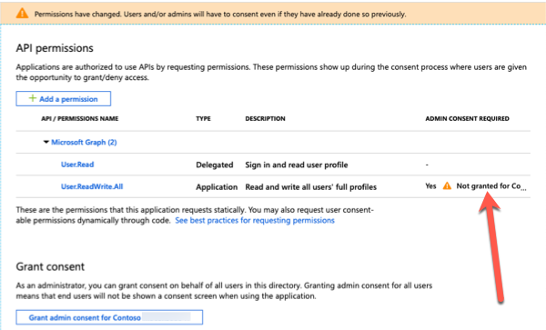

<!-- markdownlint-disable MD002 MD041 -->

En este ejercicio, creará un nuevo registro de aplicaciones Web de Azure AD con el centro de administración de Azure Active Directory y otorgará el consentimiento del administrador a los ámbitos de permiso necesarios.In this exercise, you will create a new Azure AD web application registration using the Azure Active Directory admin center and grant administrator consent to the required permission scopes.

1. Abra un explorador y vaya al [centro de administración de Azure Active Directoryhttps://aad.portal.azure.com)(](https://aad.portal.azure.com).Open a browser and navigate to the [Azure Active Directory admin center (https://aad.portal.azure.com)](https://aad.portal.azure.com). Inicie sesión con una **cuenta profesional o educativa**.Login using a **Work or School Account**.

1. Seleccione **Azure Active Directory** en el panel de navegación de la izquierda y, después, seleccione **registros de aplicaciones** en **administrar**.Select **Azure Active Directory** in the left-hand navigation, then select **App registrations** under **Manage**.

    

1. Seleccione **Nuevo registro**.Select **New registration**. En la página **registrar una aplicación**On the **Register an application** page

    

    Establezca los valores de la siguiente manera:Set the values as follows:

    - **Nombre**: GraphNotificationTutorial**Name**: GraphNotificationTutorial
    - **Tipos de cuenta compatibles**: cuentas de cualquier directorio de la organización y cuentas personales de Microsoft**Supported account types**: Accounts in any organizational directory and personal Microsoft accounts
    - **URI**de redireccionamiento: > Webhttp://localhost**Redirect URI**: Web > http://localhost

    

    Seleccione **registrar**.Select **Register**.

1. En la página **GraphNotificationTutorial** , copie el valor del identificador de la **aplicación (cliente)** y el **identificador del directorio (tenant)** guárdelos, los necesitará en el paso siguiente.On the **GraphNotificationTutorial** page, copy the value of the **Application (client) ID** and **Directory (tenant) ID** save it, you will need them in the next step.

    

1. Seleccione **administrar certificados de > & secretos**.Select **Manage > Certificates & secrets**. 

    Seleccione **nuevo secreto de cliente**.Select **New client secret**.

    Escriba un valor en **Descripción** y seleccione una de las opciones para **Expires** y seleccione **Agregar**.Enter a value in **Description** and select one of the options for **Expires** and select **Add**.

    

    

1. Copie el valor del secreto de cliente antes de salir de esta página.Copy the client secret value before you leave this page. Lo necesitará en el siguiente paso.You will need it in the next step.

    > [!IMPORTANT]
    > El secreto de cliente no se vuelve a mostrar, así que asegúrese de copiarlo en este momento.This client secret is never shown again, so make sure you copy it now.

    

1. Seleccione **administrar permisos**de la API de >.Select **Manage > API Permissions**.

    Seleccione **Agregar un permiso** y seleccione **Microsoft Graph**.Select **Add a permission** and select **Microsoft Graph**.

    

    Seleccione **permiso de aplicación**, expanda el grupo de **usuarios** y seleccione **User. ReadWrite. All** Scope.Select **Application Permission**, expand the **User** group and select **User.ReadWrite.All** scope.

    Seleccione **Agregar permisos** para guardar los cambios.Select **Add permissions** to save your changes.

    

    

La aplicación solicita un permiso de aplicación con el ámbito **User. ReadWrite. All** .The application requests an application permission with the **User.ReadWrite.All** scope. Este permiso requiere consentimiento administrativo.This permission requires administrative consent.

Seleccione **conceder consentimiento de administrador para contoso**y, a continuación, seleccione **sí** para aceptar la aplicación y conceder a la aplicación acceso a su inquilino mediante los ámbitos especificados.Select **Grant admin consent for Contoso**, then select **Yes** to consent this application and grant the application access to your tenant using the scopes you specified.

