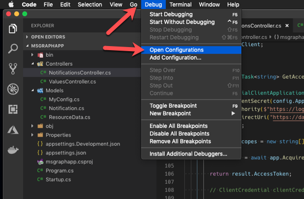
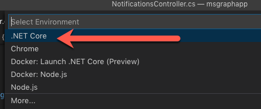
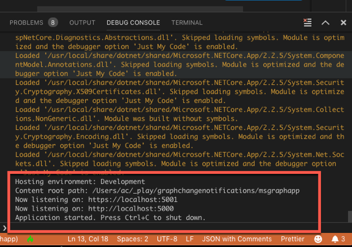
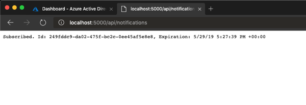

<!-- markdownlint-disable MD002 MD041 -->

<span data-ttu-id="a53a4-101">Cree una configuración de inicio para depurar la aplicación en Visual Studio Code.</span><span class="sxs-lookup"><span data-stu-id="a53a4-101">Create a launch configuration to debug the application in Visual Studio Code.</span></span>

<span data-ttu-id="a53a4-102">En Visual Studio Code, seleccione **Depurar > las configuraciones abiertas**.</span><span class="sxs-lookup"><span data-stu-id="a53a4-102">Within Visual Studio Code, select **Debug > Open Configurations**.</span></span>

  

<span data-ttu-id="a53a4-104">Cuando se le pida que seleccione un entorno, seleccione **.net Core**.</span><span class="sxs-lookup"><span data-stu-id="a53a4-104">When prompted to select an environment, select **.NET Core**.</span></span>

  

> [!NOTE]
> <span data-ttu-id="a53a4-106">De forma predeterminada, la configuración de inicio principal de .NET abrirá un explorador y se desplazará a la dirección URL predeterminada de la aplicación cuando inicie el depurador.</span><span class="sxs-lookup"><span data-stu-id="a53a4-106">By default, the .NET Core launch configuration will open a browser and navigate to the default URL for the application when launching the debugger.</span></span> <span data-ttu-id="a53a4-107">Para esta aplicación, en su lugar queremos navegar a la dirección URL NGrok.</span><span class="sxs-lookup"><span data-stu-id="a53a4-107">For this application, we instead want to navigate to the NGrok URL.</span></span> <span data-ttu-id="a53a4-108">Si deja la configuración de lanzamiento como está, cada vez que depure la aplicación se mostrará una página rota.</span><span class="sxs-lookup"><span data-stu-id="a53a4-108">If you leave the launch configuration as is, each time you debug the application it will display a broken page.</span></span> <span data-ttu-id="a53a4-109">Solo puede cambiar la dirección URL o cambiar la configuración de inicio para que no inicie el explorador:</span><span class="sxs-lookup"><span data-stu-id="a53a4-109">You can just change the URL, or change the launch configuration to not launch the browser:</span></span>

<span data-ttu-id="a53a4-110">Actualice la configuración del inicio del depurador de Visual Studio:</span><span class="sxs-lookup"><span data-stu-id="a53a4-110">Update the Visual Studio debugger launch configuration:</span></span>

  1. <span data-ttu-id="a53a4-111">En Visual Studio Code, abra el archivo **. vscode/Launch. JSON**.</span><span class="sxs-lookup"><span data-stu-id="a53a4-111">In Visual Studio Code, open the file **.vscode/launch.json**.</span></span>
  1. <span data-ttu-id="a53a4-112">Busque la siguiente sección en la configuración predeterminada:</span><span class="sxs-lookup"><span data-stu-id="a53a4-112">Locate the following section in the default configuration:</span></span>

      ```json
      "launchBrowser": {
        "enabled": true
      },
      ```

  1. <span data-ttu-id="a53a4-113">Establezca la `enabled` propiedad en `false`.</span><span class="sxs-lookup"><span data-stu-id="a53a4-113">Set the `enabled` property to `false`.</span></span>
  1. <span data-ttu-id="a53a4-114">Guarde los cambios.</span><span class="sxs-lookup"><span data-stu-id="a53a4-114">Save your changes.</span></span>

### <a name="test-the-application"></a><span data-ttu-id="a53a4-115">Pruebe la aplicación:</span><span class="sxs-lookup"><span data-stu-id="a53a4-115">Test the application:</span></span>

<span data-ttu-id="a53a4-116">En Visual Studio Code, seleccione **Depurar > iniciar** depuración para ejecutar la aplicación.</span><span class="sxs-lookup"><span data-stu-id="a53a4-116">In Visual Studio Code, select **Debug > Start debugging** to run the application.</span></span> <span data-ttu-id="a53a4-117">VS Code generará y pondrá en estrella la aplicación.</span><span class="sxs-lookup"><span data-stu-id="a53a4-117">VS Code will build and star the application.</span></span>

<span data-ttu-id="a53a4-118">Una vez que vea lo siguiente en la ventana de la **consola** de depuración...</span><span class="sxs-lookup"><span data-stu-id="a53a4-118">Once you see the following in the **Debug Console** window...</span></span>



<span data-ttu-id="a53a4-120">... Abra un explorador y vaya a **http://localhost:5000/api/notifications** para suscribirse a las notificaciones de cambios.</span><span class="sxs-lookup"><span data-stu-id="a53a4-120">... open a browser and navigate to **http://localhost:5000/api/notifications** to subscribe to change notifications.</span></span> <span data-ttu-id="a53a4-121">Si se ejecuta correctamente, verá el resultado que incluye un identificador de suscripción como el que se muestra a continuación:</span><span class="sxs-lookup"><span data-stu-id="a53a4-121">If successful you will see output that includes a subscription id like the one below:</span></span>



<span data-ttu-id="a53a4-123">La aplicación ahora está suscrita para recibir notificaciones de Microsoft Graph cuando se realiza una actualización en los usuarios en el inquilino de Office 365.</span><span class="sxs-lookup"><span data-stu-id="a53a4-123">Your application is now subscribed to receive notifications from the Microsoft Graph when an update is made on any users in the Office 365 tenant.</span></span>

<span data-ttu-id="a53a4-124">Desencadenar una notificación:</span><span class="sxs-lookup"><span data-stu-id="a53a4-124">Trigger a notification:</span></span>

1. <span data-ttu-id="a53a4-125">Abra un explorador y vaya al [centro de administración de Microsoft 365https://admin.microsoft.com/AdminPortal)(](https://admin.microsoft.com/AdminPortal).</span><span class="sxs-lookup"><span data-stu-id="a53a4-125">Open a browser and navigate to the [Microsoft 365 admin center (https://admin.microsoft.com/AdminPortal)](https://admin.microsoft.com/AdminPortal).</span></span>
1. <span data-ttu-id="a53a4-126">Si se le pide que inicie sesión, inicie sesión con una cuenta de administrador.</span><span class="sxs-lookup"><span data-stu-id="a53a4-126">If prompted to login, sign-in using an admin account.</span></span>
1. <span data-ttu-id="a53a4-127">Seleccione **usuarios > usuarios activos**.</span><span class="sxs-lookup"><span data-stu-id="a53a4-127">Select **Users > Active users**.</span></span>

    

1. <span data-ttu-id="a53a4-129">Seleccione un usuario activo y seleccione **Editar** en su **información de contacto**.</span><span class="sxs-lookup"><span data-stu-id="a53a4-129">Select an active user and select **Edit** for their **Contact information**.</span></span>

    

1. <span data-ttu-id="a53a4-131">Actualice el valor del **número de teléfono** con un número nuevo y seleccione **Guardar**.</span><span class="sxs-lookup"><span data-stu-id="a53a4-131">Update the **Phone number** value with a new number and Select **Save**.</span></span>

    <span data-ttu-id="a53a4-132">En la **consola**de depuración de Visual Studio Code, verá que se ha recibido una notificación.</span><span class="sxs-lookup"><span data-stu-id="a53a4-132">In the Visual Studio Code **Debug Console**, you will see a notification has been received.</span></span> <span data-ttu-id="a53a4-133">A veces, esto puede tardar unos minutos en llegar.</span><span class="sxs-lookup"><span data-stu-id="a53a4-133">Sometimes this may take a few minutes to arrive.</span></span> <span data-ttu-id="a53a4-134">A continuación se muestra un ejemplo del resultado:</span><span class="sxs-lookup"><span data-stu-id="a53a4-134">An example of the output is below:</span></span>

    ```shell
    Received notification: 'Users/7a7fded6-0269-42c2-a0be-512d58da4463', 7a7fded6-0269-42c2-a0be-512d58da4463
    ```

<span data-ttu-id="a53a4-135">Esto indica que la aplicación recibió correctamente la notificación de Microsoft Graph para el usuario especificado en el resultado.</span><span class="sxs-lookup"><span data-stu-id="a53a4-135">This indicates the application successfully received the notification from the Microsoft Graph for the user specified in the output.</span></span> <span data-ttu-id="a53a4-136">A continuación, puede usar esta información para consultar a Microsoft Graph para ver los detalles completos de los usuarios si desea sincronizar sus detalles con la aplicación.</span><span class="sxs-lookup"><span data-stu-id="a53a4-136">You can then use this information to query the Microsoft Graph for the users full details if you want to synchronize their details into your application.</span></span>